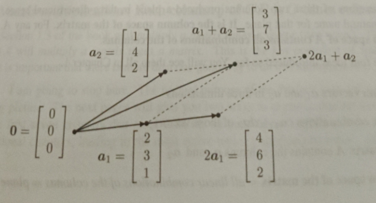
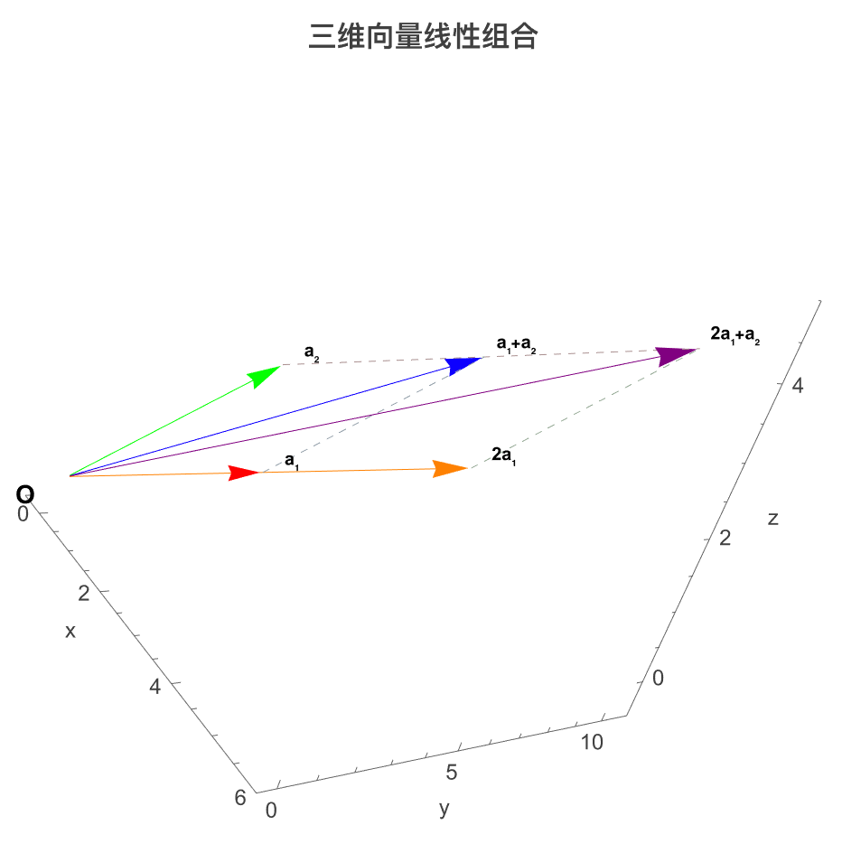
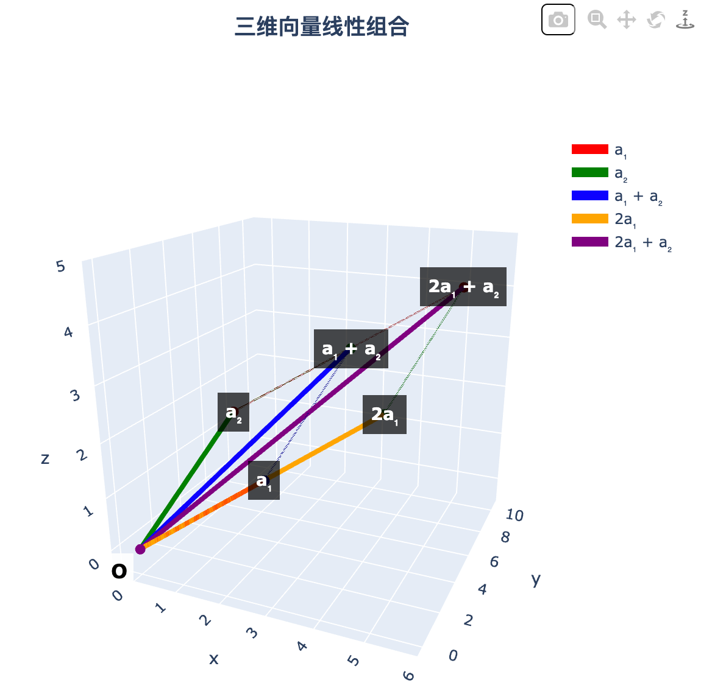

本文介绍MIT线性代数核心概念，通过三维向量实例图解线性组合、张成空间与列空间，提供Mathematica和Python可视化代码，并推荐优质课程与书籍资源。

## 正文

本前言的一个目标可以立刻实现：你需要了解麻省理工学院（MIT）线性代数课程 **Math 18.06** 的视频讲座。这些视频与本书配套，是MIT开放课程资源（OpenCourseWare）的一部分。线性代数课程的直接链接如下：

[https://ocw.mit.edu/courses/18-06-linear-algebra-spring-2010/](https://ocw.mit.edu/courses/18-06-linear-algebra-spring-2010/)

[https://ocw.mit.edu/courses/18-06sc-linear-algebra-fall-2011/](https://ocw.mit.edu/courses/18-06sc-linear-algebra-fall-2011/)

这些讲座视频可以在 [https://ocw.mit.edu/1806videos](https://ocw.mit.edu/1806videos) 以及 YouTube 的 [@1806scvideos](https://www.youtube.com/playlist?list=PL221E2BBF13BECF6C)  账号上观看。
（此处应该有掌声）

第一个链接提供了来自开放课程网（OpenCourseWare）诞生时的原始讲座。2011年的新讲座中加入了研究生们提供的问题解答（非常好），并且还附有线性代数的简短介绍。在这两个网站上，左栏是内容的链接（点击+展开）。而今天的课程则有了一个新的开始——**线性无关性**与**矩阵列空间**这些核心概念被移到了课程最前面。

我想在这篇前言里向你介绍这些核心思想。

先从两个列向量$\boldsymbol{a}_1$和$\boldsymbol{a}_2$开始。它们各自包含3个分量，因此对应三维空间中的点。这幅图需要一个定位零向量的中心点：

$$
\boldsymbol{a}_1 = \begin{bmatrix} 2 \\ 3 \\ 1 \end{bmatrix}, \quad \boldsymbol{a}_2 = \begin{bmatrix} 1 \\ 4 \\ 2 \end{bmatrix}, \quad \text{零向量} = \begin{bmatrix} 0 \\ 0 \\ 0 \end{bmatrix}
$$

这些向量绘制在这张二维页面上，但我们都具备可视化三维图形的经验。图中展示了$\boldsymbol{a}_1$、$\boldsymbol{a}_2$、$2\boldsymbol{a}_1$，以及向量和$\boldsymbol{a}_1+\boldsymbol{a}_2$。

$$
\boldsymbol{a}_2 = \begin{bmatrix} 1 \\ 4 \\ 2 \end{bmatrix}, \quad \boldsymbol{a}_1+\boldsymbol{a}_2 = \begin{bmatrix} 3 \\ 7 \\ 3 \end{bmatrix}
$$


$$
\boldsymbol{0} = \begin{bmatrix} 0 \\ 0 \\ 0 \end{bmatrix}, \quad \boldsymbol{a}_1 = \begin{bmatrix} 2 \\ 3 \\ 1 \end{bmatrix}, \quad 2\boldsymbol{a}_1 = \begin{bmatrix} 4 \\ 6 \\ 2 \end{bmatrix}
$$



---
## 备注

此处是为了理解翻译者加上的。

### 术语

| 术语             | 几何意义                     | 代数定义/运算                                                                 |
| -------------- | ------------------------ | ----------------------------------------------------------------------- |
| **列向量**        | 空间里一个点 / 从原点出发的箭头        | $\boldsymbol{a}_1=\begin{bmatrix}2\\3\\1\end{bmatrix}$                  |
| **零向量**        | 坐标原点，没有长度和方向             | $\boldsymbol{0}=\begin{bmatrix}0\\0\\0\end{bmatrix}$                    |
| **线性组合**       | 向量先缩放，再相加合成新向量           | $c_1\boldsymbol{a}_1+c_2\boldsymbol{a}_2$                               |
| **张成空间（Span）** | 所有线性组合能到达的**全部区域**       | $\operatorname{Span}\{\boldsymbol{a}_1,\boldsymbol{a}_2\}$              |
| **线性无关**       | 向量**不共线/不共面**，谁也不能被谁表示   | 仅当$c_1=c_2=0$时，$c_1\boldsymbol{a}_1+c_2\boldsymbol{a}_2=\boldsymbol{0}$ |
| **线性相关**       | 向量**共线/共面**，有冗余，一个可被其他表示 | 存在不全为0的数，使$c_1\boldsymbol{a}_1+c_2\boldsymbol{a}_2=\boldsymbol{0}$      |
| **列空间**        | 矩阵列向量**张成的平面/直线/空间**     | $A\boldsymbol{x}$ 能生成的所有$\boldsymbol{b}$集合                              |

**特别说明：**

**术语张成（Span）解释**

一、核心定义

中文术语：张成

英文对应：Span（动词）、Span of Vectors（名词）

标准定义：给定一组向量，它们的所有线性组合构成的集合，称为这组向量张成的空间；简单来说，就是这组向量通过数乘、加减运算，能覆盖到的全部点/向量的集合。

通用公式：若向量组为 $\boldsymbol{a_1},\boldsymbol{a_2},\dots,\boldsymbol{a_n}$，数 $c_1,c_2,\dots,c_n$ 为任意常数，则

$$\operatorname{span}\{\boldsymbol{a_1},\boldsymbol{a_2},\dots,\boldsymbol{a_n}\} = \bigl\{ c_1\boldsymbol{a_1} + c_2\boldsymbol{a_2} + \dots + c_n\boldsymbol{a_n} \bigm| c_1,c_2,\dots,c_n \in \mathbb{R} \bigr\}$$

二、基础几何直观（极简）

- 单个非零向量：张成一条直线（一维空间），是这条直线上所有点的集合

- 两个线性无关向量：张成一个平面（二维空间），对应三维空间内的一个完整平面

- 三个线性无关向量（三维空间）：张成整个三维空间 $\mathbb{R}^3$

关键前提：向量组线性相关时，张成空间维度会降低，无法达到向量个数对应的维度

三、术语“张成”的由来

1. 词源来源：直译自英文数学术语 Span，英文原意为“伸展、铺开、覆盖”，几何含义就是向量组铺开形成对应空间。

2. 国内定名背景：属于国内早期高等数学、线性代数教材统一规范术语，由国内数学术语审定委员会确定，并非个人随意拟定。

3. 用字含义：“张”取“张开、铺开”之意，“成”取“形成、构成”之意，合意为“铺开形成空间”；虽字面不够通俗，但为国内高校教材、考研、学术领域唯一官方标准译名，沿用至今无替代术语。

四、核心速记

考试/作业必须写：张成

理解记忆：Span = 向量组铺开、覆盖的全部空间

核心逻辑：线性组合全体 = 张成空间

**张成的平面**
\($\boldsymbol{a}_1,\boldsymbol{a}_2$\) 线性无关  
⇒ 它们**张成一个平面**（在三维空间里的一个二维平面）

所有线性组合：
$$
c_1\boldsymbol{a}_1 + c_2\boldsymbol{a}_2
$$
**几何上 = 整个平面上的所有点**

### 几何解释
##### 1. 基础向量

$$
\boldsymbol{a}_1=\begin{bmatrix}2\\3\\1\end{bmatrix},\quad
\boldsymbol{a}_2=\begin{bmatrix}1\\4\\2\end{bmatrix}
$$

**几何理解**
- 都在**三维空间**里
- 从**原点 0** 出发的箭头
- 两个向量**不共线**

---

##### 2. 数乘
\($2\boldsymbol{a}_1$\)
$$
2\boldsymbol{a}_1=\begin{bmatrix}4\\6\\2\end{bmatrix}
$$
**几何意义**
- 和 \( $\boldsymbol{a}_1$ ) **同方向**
- 长度变成原来的 **2 倍**
- 仍在同一条直线上

---

##### 3. 向量和
\($\boldsymbol{a}_1+\boldsymbol{a}_2$\)

$$
\boldsymbol{a}_1+\boldsymbol{a}_2=\begin{bmatrix}3\\7\\3\end{bmatrix}
$$
**几何意义（平行四边形法则）**
1. 以 \($\boldsymbol{a}_1,\boldsymbol{a}_2$\) 为邻边
2. 画出平行四边形
3. **对角线**就是 \($\boldsymbol{a}_1+\boldsymbol{a}_2$\)

---

### 几何空间示意图

- \($O$\) = 原点 = **零向量**
- \($a_1$\)、\($a_2$\) = 两个不在同一直线上的向量
- \($2a_1$\) = 沿 \($a_1$\) 延长一倍
- \($a_1+a_2$\) = 平行四边形对角线
- **\($2\boldsymbol{a_1}+\boldsymbol{a_2}$\)** = 先把 \($\boldsymbol{a_1}$\) 延长一倍得到 \($2\boldsymbol{a_1}$\)，再以 \($2\boldsymbol{a_1}$\) 和 \($\boldsymbol{a_2}$\) 为邻边做平行四边形，**这条新的对角线就是 \($2\boldsymbol{a_1}+\boldsymbol{a_2}$\)**

简单记：
**系数就是“放缩几倍”，加号就是“平行四边形对角线”。** 直观展示如下：



---
对应 mathematica 代码：

```mathematica
(* 定义向量 *)
origin = {0, 0, 0};
a1 = {2, 3, 1};           (* 红色 *)
a2 = {1, 4, 2};           (* 绿色 *)
a1plusa2 = a1 + a2;       (* 蓝色 *)
twoa1 = 2 a1;             (* 橙色 *)
twoa1plusa2 = twoa1 + a2; (* 紫色 *)

(* 主要实线箭头 *)
mainArrows = {
  {Red, Arrow[{origin, a1}, 0.05]},                    (* a1 *)
  {Green, Arrow[{origin, a2}, 0.05]},                  (* a2 *)
  {Blue, Arrow[{origin, a1plusa2}, 0.05]},             (* a1+a2 *)
  {Orange, Arrow[{origin, twoa1}, 0.05]},              (* 2a1 *)
  {Purple, Arrow[{origin, twoa1plusa2}, 0.05]}         (* 2a1+a2 *)
};

(* 所有虚线路径 *)
dashedLines = {
  {Dashed, Darker[LightBlue], Line[{a1, a1plusa2}]},    (* a1 -> a1+a2 *)
  {Dashed, Darker[LightGreen], Line[{a2, a1plusa2}]},   (* a2 -> a1+a2 *)
  {Dashed, Darker[LightGreen], Line[{twoa1, twoa1plusa2}]}, (* 2a1 -> 2a1+a2 *)
  {Dashed, Darker[LightRed], Line[{a2, twoa1plusa2}]}   (* a2 -> 2a1+a2 *)
};

(* 关键点标签 *)
labels = {
  Text[Style["a₁", Bold, 10], a1 + {0.3, 0.3, 0.3}],
  Text[Style["a₂", Bold, 10], a2 + {0.3, 0.3, 0.3}],
  Text[Style["a₁+a₂", Bold, 10], a1plusa2 + {0.3, 0.3, 0.3}],
  Text[Style["2a₁", Bold, 10], twoa1 + {0.3, 0.3, 0.3}],
  Text[Style["2a₁+a₂", Bold, 10], twoa1plusa2 + {0.3, 0.3, 0.3}]
};

(* 原点标签 *)
originLabel = Text[Style["O", Bold, 14], origin - {0.5, 0.5, 0.5}];

(* 绘图 *)
Graphics3D[
 Join[mainArrows, dashedLines, labels, {originLabel}],
 Axes -> True,
 Boxed -> False,
 AxesLabel -> {"x", "y", "z"},
 LabelStyle -> {12, FontFamily -> "Arial"},
 PlotRange -> {{-0.5, 6}, {-0.5, 11}, {-0.5, 5}},
 BoxRatios -> {1, 1, 1},
 ImageSize -> Large,
 ViewPoint -> {2, 1.5, 1},
 PlotLabel -> Style["三维向量线性组合", Bold, 16],
 Background -> White
]
```



对应 Jupyter

```python
import numpy as np  
import plotly.graph_objects as go  
import plotly.io as pio  
  
# 强制使用 iframe 渲染器（兼容性最佳）  
pio.renderers.default = "iframe"  
  
# --- 向量定义 ---O = np.array([0, 0, 0])  
a1 = np.array([2, 3, 1])  
a2 = np.array([1, 4, 2])  
a1_plus_a2 = a1 + a2  
two_a1 = 2 * a1  
two_a1_plus_a2 = two_a1 + a2  
  
def add_vector(fig, start, end, color, name=None, width=6, dash=None):  
    """添加向量（实线或虚线）"""  
    fig.add_trace(go.Scatter3d(  
        x=[start[0], end[0]],  
        y=[start[1], end[1]],  
        z=[start[2], end[2]],  
        mode='lines+markers',  
        line=dict(color=color, width=width, dash=dash),  
        marker=dict(size=5, color=color),  
        name=name,  
        showlegend=bool(name)  
    ))  
  
# 创建图形  
fig = go.Figure()  
  
# === 主向量（实线箭头）===  
add_vector(fig, O, a1, 'red', 'a₁', width=8)  
add_vector(fig, O, a2, 'green', 'a₂', width=8)  
add_vector(fig, O, a1_plus_a2, 'blue', 'a₁ + a₂', width=8)  
add_vector(fig, O, two_a1, 'orange', '2a₁', width=8)  
add_vector(fig, O, two_a1_plus_a2, 'purple', '2a₁ + a₂', width=8)  
  
# === 虚线辅助路径（显示构造过程）===  
add_vector(fig, a1, a1_plus_a2, 'darkblue', width=3, dash='dot')  
add_vector(fig, a2, a1_plus_a2, 'darkgreen', width=3, dash='dot')  
add_vector(fig, two_a1, two_a1_plus_a2, 'darkgreen', width=3, dash='dot')  
add_vector(fig, a2, two_a1_plus_a2, 'darkred', width=3, dash='dot')  
  
# === 点标注：使用 HTML 模拟数学公式 ===# 我们用 <b> 表示粗体，用 Unicode 下标（如 ₁, ₂）模拟 LaTeXannotations = []  
points = [a1, a2, a1_plus_a2, two_a1, two_a1_plus_a2]  
labels_html = [  
    "<b>a₁</b>",  
    "<b>a₂</b>",  
    "<b>a₁ + a₂</b>",  
    "<b>2a₁</b>",  
    "<b>2a₁ + a₂</b>"  
]  
  
for pt, label in zip(points, labels_html):  
    annotations.append(dict(  
        x=pt[0], y=pt[1], z=pt[2],  
        text=label,  
        showarrow=False,  
        font=dict(size=14, color="white"),  
        bgcolor="rgba(0, 0, 0, 0.7)",   # 半透明黑底，提高可读性  
        borderpad=6,  
        xanchor="center",  
        yanchor="middle"  
    ))  
  
# 原点标注  
annotations.append(dict(  
    x=O[0] - 0.4, y=O[1] - 0.4, z=O[2] - 0.4,  
    text="<b>O</b>",  
    showarrow=False,  
    font=dict(size=16, color="black"),  
    bgcolor="rgba(255, 255, 255, 0.9)",  
    borderpad=4  
))  
  
# === 布局设置 ===fig.update_layout(  
    title={  
        'text': "<b>三维向量线性组合</b>",  
        'x': 0.5,  
        'xanchor': 'center',  
        'font': {'size': 18}  
    },  
    scene=dict(  
        xaxis_title="x",  
        yaxis_title="y",  
        zaxis_title="z",  
        aspectmode="cube",  
        annotations=annotations,  
        camera=dict(eye=dict(x=1.8, y=1.5, z=1.2)),  
        xaxis=dict(range=[-0.5, 6]),  
        yaxis=dict(range=[-0.5, 11]),  
        zaxis=dict(range=[-0.5, 5])  
    ),  
    legend=dict(  
        x=0.75,  
        y=0.9,  
        bgcolor="rgba(255,255,255,0.8)",  
        font=dict(size=12)  
    ),  
    margin=dict(l=0, r=0, t=50, b=0),  
    width=800,  
    height=600  
)  
  
# 显示图形  
fig.show()
```
## 进阶课程

1、[MIT 线性代数](https://www.bilibili.com/video/BV1bb411H7JN/)

2、[哈工大线性代数与空间解析几何](https://www.bilibili.com/video/BV1dW411P7YM)

## 参考书籍

1、本书（强烈推荐）

2、[《线性代数与空间解析几何》]

3、线性代数同济大学（不推荐，非常烂）