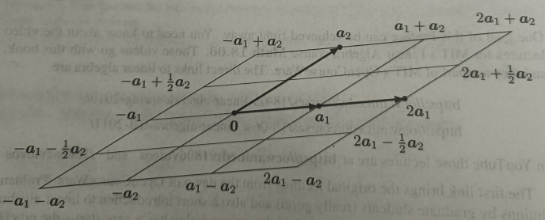

That picture illustrated two basic operations—adding vectors \($a_1 + a_2$\) and multiplying a vector by 2. Combining those operations produced a "linear combination" \($2a_1 + a_2$\):

$$
\text{Linear combination} = c a_1 + d a_2 \quad \text{for any numbers } c \text{ and } d
$$

Those numbers \($c$\) and \($d$\) can be negative. In that case \($c a_1$\) and \($d a_2$\) will reverse their directions: they go right to left. Also very important, \($c$\) and \($d$\) can involve fractions. Here is a picture with a lot more linear combinations. Eventually we want all vectors \($c a_1 + d a_2$\).

Here is the key! The combinations \($c a_1 + d a_2$\) fill a whole plane. It is an infinite plane in 3-dimensional space. By using more and more fractions and decimals \(c\) and \(d\), we fill in a complete plane. Every point on the plane is a combination of \($a_1$\) and \($a_2$\).

Now comes a fundamental idea in linear algebra: **a matrix**. The matrix \($A$\) holds \($n$\) column vectors \($a_1, a_2, \dots, a_n$\). At this point our matrix has two columns \($a_1$\) and \($a_2$\), and those are vectors in 3-dimensional space. So the matrix has three rows and two columns.

$$\
\begin{aligned}
&3 \text{ by } 2 \text{ matrix} \\
&m = 3 \text{ rows} \\
&n = 2 \text{ columns}
\end{aligned}
\quad
A = \begin{bmatrix} a_1 & a_2 \end{bmatrix} = \begin{bmatrix} 2 & 1 \\ 3 & 4 \\ 1 & 2 \end{bmatrix}
$$

The combinations of those two columns produced a plane in three-dimensional space. There is a natural name for that plane. It is the **column space** of the matrix. For any \($A$\), the column space of \($A$\) contains all combinations of the columns.

Here are the four ideas introduced so far. You will see them all in Chapter 1.

1. Column vectors \($a_1$\) and \($a_2$\) in three dimensions
2. Linear combinations \($c a_1 + d a_2$\) of those vectors
3. The matrix \($A$\) contains the columns \($a_1$\) and \($a_2$\)
4. Column space of the matrix = all linear combinations of the columns = plane