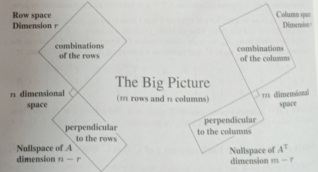

**The Four Fundamental Subspaces**

You have just seen how the course begins—with the columns of a matrix A. There were two key steps. One step was to take all combinations \($ca_1 + da_2 + ea_3 + fa_4$\) of the columns. This led to the **column space of A**. The other step was to factor the matrix into \($C\times R$\). That matrix \($C$\) holds a full set of **independent columns**.

I fully recognize that this is only the Preface to the book. You have had zero practice with the column space of a matrix (and even less practice with \($C$\) and \($R$\)). But the good thing is: Those are the right directions to start. Eventually, every matrix will lead to four fundamental spaces. Together with the column space of A comes the row space—all combinations of the rows. When we take all combinations of the \($n$\) columns and all combinations of the \($m$\) rows—those combinations fill up "spaces" of vectors.

The other two subspaces complete the picture. Suppose the row space is a plane in three dimensions. Then there is one special direction in the 3D picture—that direction is perpendicular to the row space. That perpendicular line is the null space of the matrix. We will see that the vectors in the null space (perpendicular to all the rows) solve \($Ax$ = 0\): the most basic of linear equations.

And if vectors perpendicular to all the rows are important, so are the vectors perpendicular to all the columns. Here is the picture of the Four Fundamental Subspaces.

The Four Fundamental Subspaces: An \($m$\) by \($n$\) matrix with \($r$) independent columns.

This picture of four subspaces comes in Chapter 3. The idea of perpendicular spaces is developed in Chapter 4. And special "basis vectors" for all four subspaces are discovered in Chapter 7. That step is the final piece in the Fundamental Theorem of Linear Algebra. The theorem includes an amazing fact about any matrix, square or rectangular:
**The number of independent columns equals the number of independent rows.**